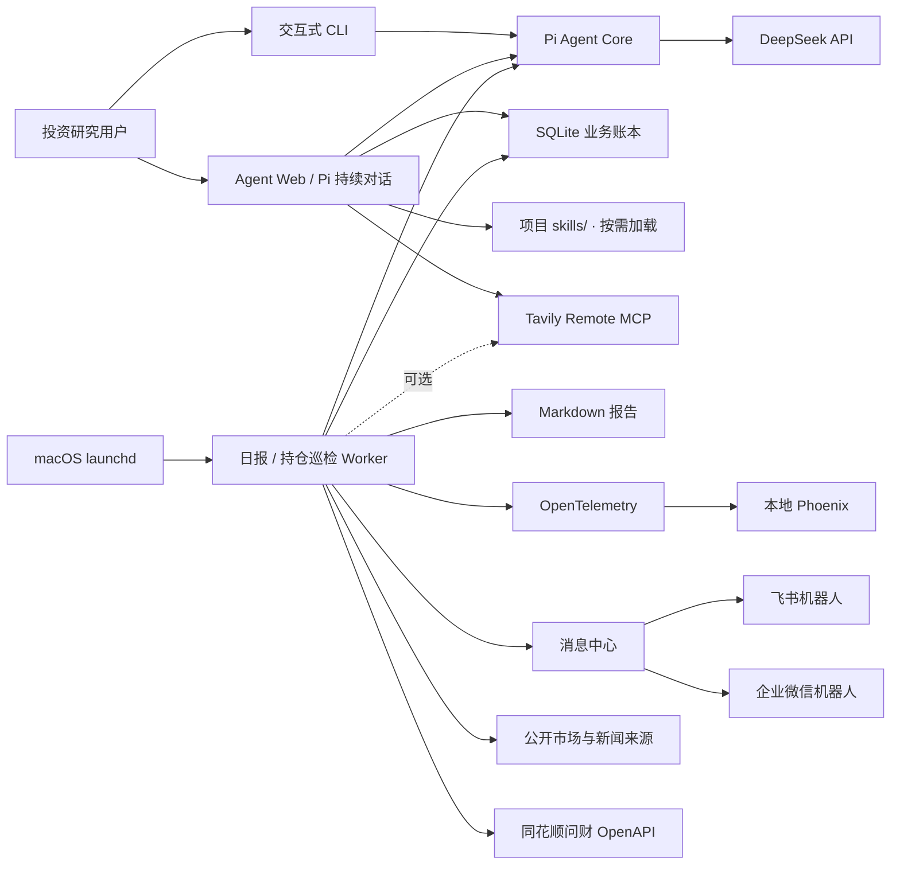
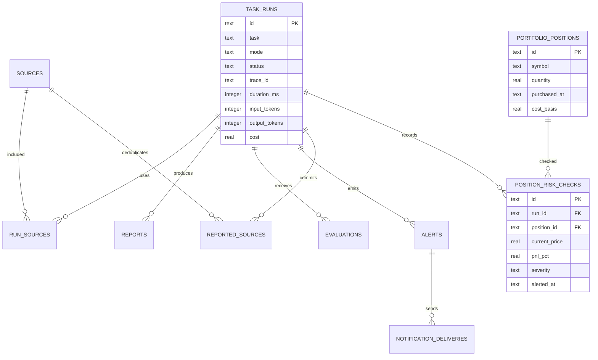
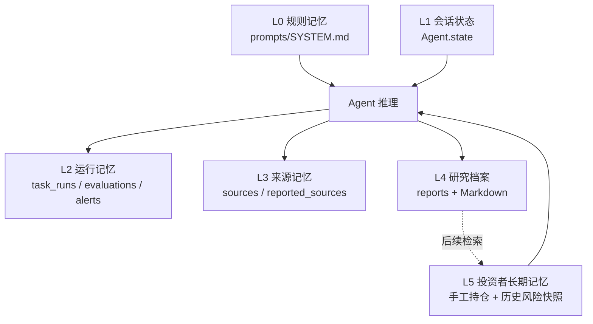
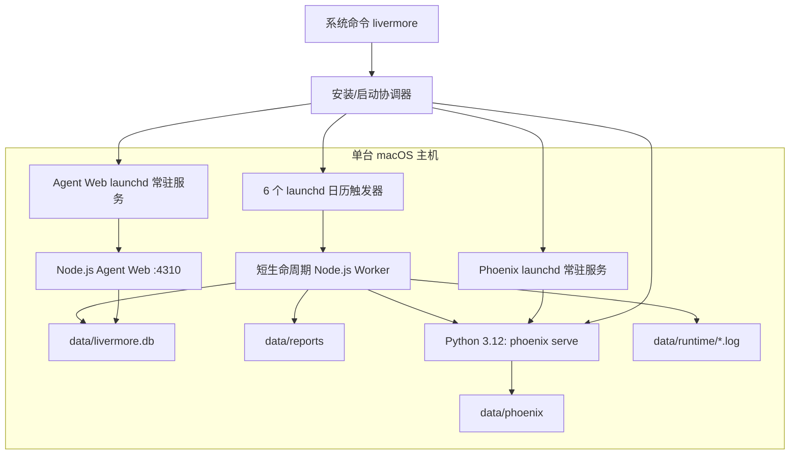

# Livermore 单机长期 Agent 架构

本文描述 Livermore 当前实现的 Agent 模式、任务闭环、记忆、持久化、Trace、消息中心和运行拓扑。

## 1. 设计边界

1. 研究与交易执行隔离：不连接券商，不下单。
2. 证据先于结论：实时事实只能来自本次采集材料。
3. 确定性代码包围模型：调度、采集、去重、事务、评估和告警由代码控制。
4. 本地优先：业务状态、报告、Trace 和调度均留在单台电脑。
5. 观测不阻塞业务：Phoenix 不可用时任务仍能完成。
6. 模型与数据源仍是网络依赖；“本地”不等于完全离线。

## 2. 系统上下文



## 3. Agent 架构模式

交互问答是“受限单 Agent”。日报和持仓巡检均采用“确定性工作流包围 Agent”：日报先采集证据再交给 Agent 综合；持仓 Agent 自主读取项目 Skill 并调用受限行情工具，随后由代码复核硬阈值。

```mermaid
flowchart LR
    Trigger["调度触发"] --> Ledger["创建 task_run"]
    Ledger --> Lock["任务锁与幂等检查"]
    Lock --> Collect["采集来源"]
    Collect --> Normalize["标准化"]
    Normalize --> Dedupe["SQLite 去重"]
    Dedupe --> Agent["Agent 综合"]
    Agent --> Save["报告落盘"]
    Save --> Evaluate["确定性质量评估"]
    Evaluate --> Commit["提交来源和运行结果"]
    Commit --> Notify["消息中心汇报"]
```



模型不自主浏览网页。采集结果先被归一化为 `SourceItem`，提示词明确将网页视作不可信数据，Agent 只负责基于证据综合和表达。

持仓巡检的 Agent 只开放 `read_skill` 与 `query_iwencai_market`。它必须先读取 `hithink-market-query`，再查询本次持仓并生成解释；工具原始行情由外层工作流捕获，经 `Iwencai → NormalizedMarketQuote` 适配层统一证券代码和字段别名，并按标的合并多次查询结果。盈亏和报警等级只读取标准化对象，由确定性代码重新计算。每个标准化对象保留原始行、查询语句和问财 Trace ID，既保留 Agent 的 Skill 驱动能力和审计证据，也避免模型决定止损、伪造价格或降低风险等级。

## 4. 运行事务与幂等

每次执行先生成 UUID `run_id`，并以 `task + 本地日期 + mode` 作为幂等键。相同模式已经成功或仍在运行时，默认拒绝重复执行；显式 `--force` 可重跑。失败记录不会阻止下一次重试。

SQLite `task_locks` 防止同一任务并行运行，锁默认 30 分钟过期。报告写入并完成评估后，才提交 `reported_sources`，因此中途失败不会提前消费来源。

## 5. 数据模型



业务库位于 `data/livermore.db`，启用 WAL、外键和 5 秒 busy timeout。它保存任务事实，不依赖 Phoenix。

## 6. 记忆架构



当前长期记忆包括运行审计、来源去重、研究归档、用户手工持仓和逐次风险快照。风险偏好暂由确定性阈值表达，尚未建立组合级风险预算。后续优先使用 SQLite FTS5，再评估是否需要向量数据库。

## 7. Trace 架构

每次 `task_run` 对应一个根 Trace，Trace ID 回写业务库：

```text
briefing.run
├── source.collect
│   ├── tavily.mcp.search
│   └── source.direct.fetch
├── source.deduplicate
├── agent.run
│   └── agent.turn
│       ├── gen_ai.chat
│       └── tool.<name>
├── report.persist
└── report.evaluate

portfolio.risk_check
├── agent.run
│   └── agent.turn
│       ├── gen_ai.chat
│       ├── tool.read_skill
│       └── tool.query_iwencai_market
├── market.normalize
├── portfolio.position_check
└── portfolio.alert（按需）
```

Pi Agent 的事件订阅被映射为 OpenInference `AGENT`、`LLM` 与 `TOOL` Span，工作流节点标记为 `CHAIN`。模型 Span 记录 provider、model、stop reason、输入/输出/cache/reasoning token 和成本。`TRACE_CONTENT_ENABLED=true` 时，Prompt、Response、工具参数和工具结果写入本机 Phoenix；设为 `false` 可只保留元数据。Trace 内容可能包含持仓和研究材料，不应对外暴露 Phoenix。

CLI 是短生命周期进程，退出前调用 `forceFlush()`。Trace 导出失败只打印提示，不回滚成功日报。

## 8. 质量评估

当前内置三个无需额外模型调用的评估器：

- `citation-validity`：报告中的 `[Sx]` 是否对应本次来源。
- `section-coverage`：任务要求的核心主题是否覆盖。
- `research-boundary`：是否保留研究免责声明。

评估结果写入 `evaluations`，并作为 `report.evaluate` Span 属性进入 Phoenix。后续可增加新鲜度、数字忠实度、跨期重复率、人工评分与 LLM Judge，但 LLM 评分不能替代确定性检查。

## 9. 消息中心与报警

消息中心把“记录告警”和“外部投递”分开：先写 `alerts`，再逐通道写 `notification_deliveries`。单个 Webhook 失败不会让任务从成功变为失败。

当前通道：

- 飞书群机器人文本消息。
- 企业微信群机器人文本消息。

日报成功运行发送摘要、评估和报告正文；持仓巡检只在风险首次出现、升级或超过 4 小时冷却期时发送提醒；运行异常发送 critical 告警。持仓规则由代码确定：亏损 5%/10%、日跌幅 4%/7%、下跌叠加主力流出、RSI 过热和数据缺失。Agent 负责解释影响，不由模型独立决定是否报警。

## 10. 运行拓扑



Phoenix 安装在项目独立的 `.venv-phoenix/`，由 `launchd` 登录时启动并保持运行，不依赖 Docker daemon。默认工作日时间：市场简报 08:30、12:00、16:10；AI 产业链日报 08:45、17:00；持仓巡检 09:30、10:30、11:30、13:30、14:30、15:00。`launchd` 使用系统时区，任务日期使用 `APP_TIMEZONE`，两者应保持一致。

`~/.local/bin/livermore` 指向仓库中的轻量启动器。默认命令检查 Agent Web、Phoenix 和 launchd 注册状态，等待本地服务健康后，通过 macOS 打开 `http://127.0.0.1:4310`。Phoenix `http://localhost:6006` 只作为二级 Trace 观测台。

## 11. 故障语义

| 故障 | 行为 |
|---|---|
| Tavily 超额或不可用 | 记录 warning，降级到直接来源 |
| 部分网页失败 | 保留成功来源，记录 warning |
| 所有来源失败 | 任务失败并发送 critical 告警 |
| DeepSeek 失败 | 任务失败，不提交来源去重 |
| Phoenix 未启动 | Trace flush 提示，业务任务继续 |
| 飞书或企业微信失败 | 保存失败投递记录，任务保持原状态 |
| 重复调度 | 幂等检查拒绝重复成功运行 |
| 持仓行情缺失 | 标准化与多结果合并后仍无匹配行情时，保存 warning 快照并提示人工复核 |
| 进程崩溃遗留锁 | 锁过期后可重新执行 |

## 12. 后续阶段

1. 在现有持仓模型上增加组合级风险预算、自选股和关注事件。
2. 为标准化行情层增加来源质量等级、交易日期与时效 SLA。
3. 增加任务缺失、连续失败和来源异常的本地健康巡检。
4. 增加报警规则、确认状态、冷却期和误报反馈。
5. 建立报告黄金集、跨版本回放和人工评分面板。
